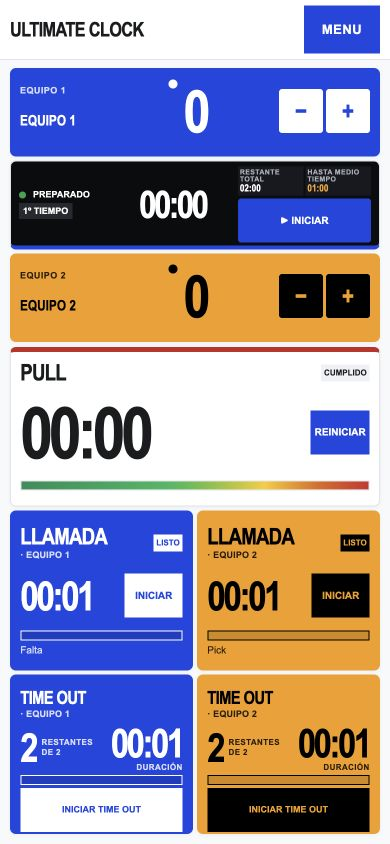
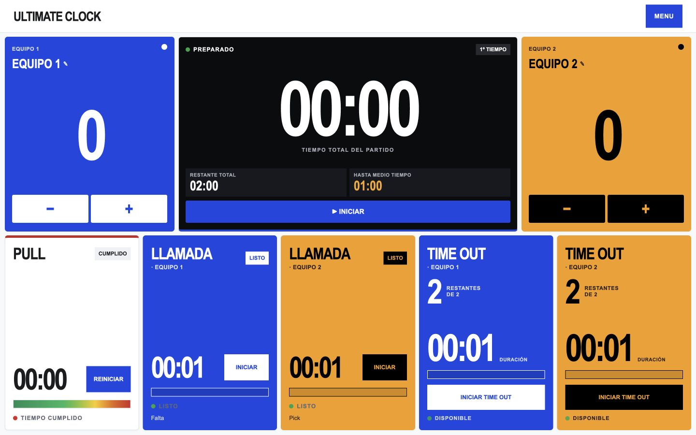

# ULTIMATE CLOCK

> Tablero táctil local-first para operar un partido de Ultimate Frisbee.

[](https://iona.ar/ultimateclock/)
[](qa/pruebas.txt)
[](#licencia)

ULTIMATE CLOCK es un proyecto de **Juan Martínez García / IONA**. Está pensado para una mesa de tiempo que necesita leer y accionar el partido desde un teléfono, tableta o pantalla de cancha sin depender de una cuenta ni de un backend.

Tablero local para controlar un partido de Ultimate Frisbee. Esta entrega toma como punto de partida el prototipo UX/UI Stitch aportado por Juan y reemplaza la interfaz anterior. El prototipo es referencia de diseño; sus datos de ejemplo no se consideran reglas ni datos reales.

Versión publicada: [iona.ar/ultimateclock](https://iona.ar/ultimateclock/). La misma app se puede usar desde el ZIP sin depender del VPS.

## Documentación del proyecto

- [Brief de producto](docs/PRODUCT.md): problema, usuarios, alcance y próximos pasos.
- [Caso de estudio](docs/CASE-STUDY.md): decisiones de UX/UI, proceso y aprendizajes.
- [Arquitectura](docs/ARCHITECTURE.md): estado, contratos de tiempo y publicación.
- [Dirección visual](DESIGN.md): sistema de layout, responsive y comportamiento de widgets.
- [Verificación](qa/VERIFICACION.md): recorridos, medidas y límites conocidos.
- [Historial de cambios](CHANGELOG.md).

## Vista del producto





## Abrir

1. Extraé el ZIP completo. No abras `index.html` desde la vista previa del ZIP: necesita los archivos que están a su lado.
2. Dentro de la carpeta extraída, hacé doble clic en `Iniciar Ultimate Clock.command`. El iniciador abre automáticamente la dirección correcta en el navegador predeterminado. Dejá su ventana abierta mientras usás la app.
3. El iniciador usa 8766 y, si está ocupado, elige el primer puerto libre hasta 8799. Muestra la dirección exacta. Si preferís iniciar manualmente: desde esta carpeta ejecutá `python3 -m http.server 8766 --bind 127.0.0.1` y abrí http://127.0.0.1:8766/.

Abrir `index.html` directamente usa el protocolo `file:`, cuyas funciones de almacenamiento e instalación pueden variar según el navegador. El iniciador local es la opción recomendada.

No necesita instalar paquetes ni crear cuentas. Los datos se guardan en el navegador del dispositivo.

## Uso

Al abrir la app aparece **PERFIL DE TIEMPO** con WFDF, USA Ultimate, los perfiles guardados y **NUEVO PERFIL**, que lleva directamente al formulario de creación. Si el partido ya comenzó, su perfil no se puede cambiar; se puede crear otro para el próximo partido.

El botón **MENU** reúne todas las opciones del encabezado: primero **＋ NUEVO PARTIDO** (en color), luego Planilla, Guardar, **ACTIVAR/DESACTIVAR SONIDO**, **PROBAR SONIDO**, Pantalla completa, Configurar, Cómo usar la app, Info y **MODO CLARO / MODO OSCURO**. Al abrirlo se oscurece y difumina el fondo. En vertical, el reloj del partido va arriba, debajo los dos equipos lado a lado, luego las Llamadas y al final Pull y Time Out; todo entra en la pantalla sin scroll.

1. Antes del partido elegí WFDF, USA Ultimate o creá un perfil PERSONALIZADO con nombre. Configurá tiempo total, primer tiempo, medio tiempo, pull, llamada, time out y cupo de timeouts por equipo y mitad.
2. Tocá **ACTIVAR SONIDO** y luego **PROBAR SONIDO** para escuchar cinco alarmas agudas y ajustar el volumen del dispositivo. El botón pasa a **DESACTIVAR SONIDO** cuando el navegador habilitó el audio. El reloj total es el único que se puede pausar. Pull, llamada, time out y medio tiempo corren hasta cero; cada finalización emite cinco alarmas agudas y un aviso visual intenso. **REINICIAR** en Pull o Llamada devuelve la cuenta a Listo sin arrancarla.
3. Al cumplirse el primer tiempo, iniciá el medio tiempo desde el aviso. Al terminar el descanso, iniciá la segunda mitad; se renueva el cupo de timeouts de cada equipo.
4. Registrá goles, llamadas, timeouts e incidencias desde el tablero o la planilla. En horizontal, Pull queda al centro y cada Llamada del lado de su equipo. Un solo widget de TIME OUT contiene dos botones con los colores y cupos restantes de los equipos. La planilla identifica qué equipo hizo cada llamado.
5. Guardá el partido al terminar. La pestaña **Planilla** muestra el partido actual con los botones **EXPORTAR** (PDF para imprimir o compartir, CSV para planillas de cálculo y JSON como respaldo completo) y, debajo, las planillas guardadas, que también se pueden abrir y exportar. La app espera a que finalicen las cuentas no pausables antes de guardar.

El botón Reiniciar contadores reinicia solo el partido actual después de confirmación. Conserva el historial y los perfiles personalizados. Nuevo partido conserva los nombres y colores de los equipos.

## Reglamentos y tiempos

Los perfiles WFDF 2025–2028 y USA Ultimate 2026–2027 son puntos de partida. WFDF usa time out de 75 s y USA Ultimate uno de 70 s; los límites de duración del partido y algunos tiempos operativos pueden variar según torneo. Revisá los valores con la organización antes de jugar. Al crear un perfil personalizado, queda disponible en el desplegable.

Las categorías de Llamada son Falta, Violación, Pick, Travel, Stall, Gol discutido, Lesión y Tiempo de Espíritu. La app muestra una explicación breve de cada una. Se usan para registrar el hecho y el equipo que lo llamó: **no aplican sanciones ni resuelven disputas automáticamente**. Lesión y Tiempo de Espíritu son detenciones con condiciones propias; el tiempo configurable del widget es una referencia operativa, no una duración oficial universal. Consultá el [reglamento WFDF](https://rules.wfdf.sport/) o las [reglas USA Ultimate 2026–2027](https://usaultimate.org/rules/) y las condiciones del torneo.

Fuentes consultadas el 27/09/2026: [reglas y recursos WFDF](https://rules.wfdf.sport/resources/) y [reglas oficiales USA Ultimate](https://usaultimate.org/rules/). El plan del usuario y el código previo de UFM se usaron como contexto del producto.

## Datos y funcionamiento

- Estado local versionado en `ultimate-clock-v2`. No modifica `ultimate-clock-v1` ni los datos de la app educativa UFM.
- La versión anterior que estuvo publicada en esta URL usaba `ultimateClock.v1`. Sus datos siguen en el almacenamiento del navegador, pero no se migran ni se muestran automáticamente en esta versión. Se guardó un respaldo de sus archivos en el VPS antes de publicar.
- `localhost`, `127.0.0.1`, un archivo local y un sitio publicado tienen almacenamientos separados. Si se borra el almacenamiento del navegador, se pierden las planillas; exportá las que necesites conservar.
- Los puertos distintos también separan el almacenamiento: si cambia el puerto, el historial anterior no aparece en esa dirección. El iniciador prioriza siempre los mismos puertos para mantener el origen estable. Exportá las planillas importantes como JSON.
- Si el almacenamiento falla o tiene formato incompatible, se ofrece un respaldo y no se sobrescriben silenciosamente los datos anteriores. Los cambios desde otra pestaña piden recargar para evitar sobrescrituras.
- Los relojes usan marcas de tiempo, así que recuperan el tiempo transcurrido tras suspender la pestaña. El navegador puede volver a pedir una interacción para habilitar audio después de recargar o reanudar. El botón de sonido muestra el estado real del contexto de audio; los avisos visuales no dependen de él.
- La interfaz tiene temas Claro y Oscuro, controles táctiles amplios, foco en diálogos y reducción de movimiento. En la edición de equipo, **MÁS COLORES** abre el selector libre del dispositivo.
- Al abrir la app se elige un perfil y luego se toca **USAR ESTE PERFIL**. **CÓMO USAR LA APP** abre un recorrido guiado de seis pasos sobre el tablero; se puede volver a abrir desde **MENU**.
- El pie enlaza a IONA.AR y a Ultimate Frisbee Mendoza. **APOYÁ ESTE PROYECTO** conserva por ahora `href="#"` y muestra un aviso: todavía no existe un enlace de donación.

## Estructura

- `index.html` y `ultimate-clock.html`: entradas equivalentes.
- `clock-engine.js`: motor temporal y validación de configuración.
- `alerts.js`: audio y avisos.
- `sheet-export.js`: exportación de planillas a PDF y CSV, sin dependencias.
- `ultimate-clock.js`: tablero, equipos, perfiles, planilla, modales y planillas guardadas.
- `tokens.css` y `ultimate-clock.css`: estilos Claro/Oscuro y diseño adaptable.
- `Iniciar Ultimate Clock.command`: servidor local y apertura automática en navegador.
- `sw.js`, `manifest.webmanifest` e `icon.svg`: carga offline e instalación.
- `tests/` y `qa/`: pruebas y evidencia de verificación.
- `scripts/publicar-vps.sh`: publicación en `iona.ar/ultimateclock`.

Para ejecutar las pruebas: `node --test tests/*.test.cjs`.

## Publicar

La app se sirve como archivos estáticos desde el VPS de IONA (sitio `iona-web`, carpeta `/opt/iona-web/site/ultimateclock`). Para publicar lo que está en `main`, ejecutá en el VPS:

```bash
curl -fsSL https://raw.githubusercontent.com/juanaustral/ultimate-clock/main/scripts/publicar-vps.sh -o /tmp/publicar-vps.sh
bash /tmp/publicar-vps.sh
```

El script respalda la versión publicada en `/opt/iona-web/backups/ultimateclock-pre-<fecha>.tar.gz`, copia solo los archivos de la app y compara el SHA-256 de cada archivo servido con el del repositorio. Si algo difiere, termina con error e indica cómo restaurar el respaldo. No cambia Caddy ni DNS. Antes de publicar, subí la versión de caché en `sw.js` para que los teléfonos que ya tienen la app instalada reciban la nueva.

## Licencia

Ultimate Clock se publica bajo la [PolyForm Noncommercial License 1.0.0](LICENSE.md). Podés leer, usar, modificar y compartir el código con cualquier fin no comercial. El uso comercial requiere permiso de Juan Martínez García / IONA.

La fuente JetBrains Mono incluida en `prototipos-ufm/` conserva su propia licencia, la SIL Open Font License 1.1.

## Pendiente externo

La verificación física del volumen y la legibilidad en cancha requiere un dispositivo iOS/Android real. La app está publicada en `https://iona.ar/ultimateclock/`; no se modificó la app educativa UFM.
